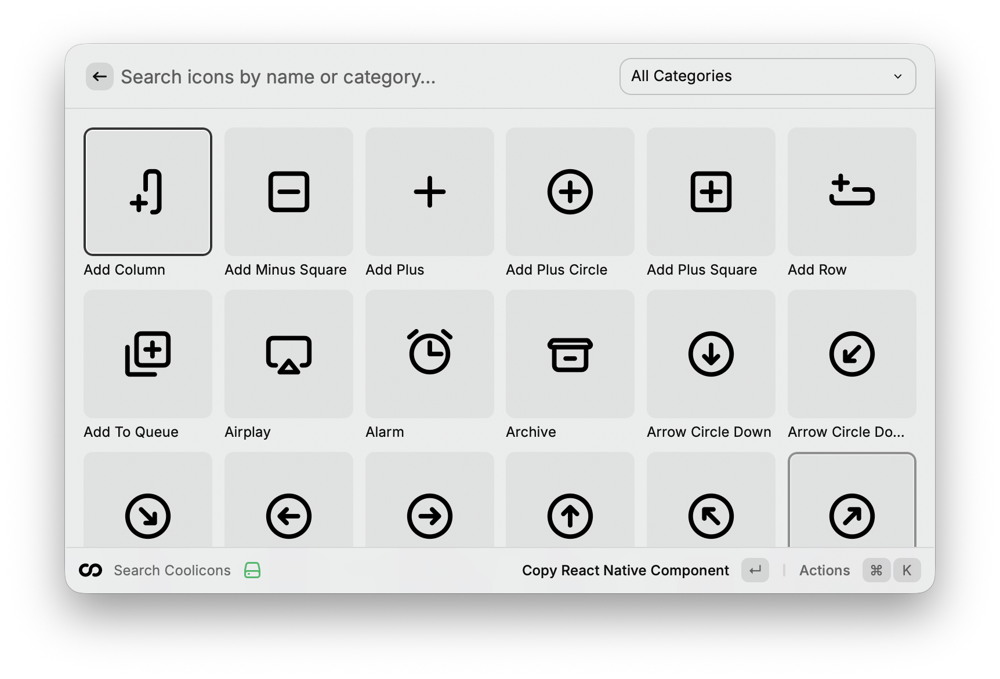

# Coolicons for Raycast

Search and copy 440+ Coolicons icons in multiple formats. Export as SVG, React, React Native components, or PNG images.



## Features

- 🔍 **Search 440+ icons** - Quick fuzzy search through the entire Coolicons library
- 👁️ **Grid and list view** - Choose your preferred browsing experience
- 📋 **Multiple export formats** - Copy as name, SVG code, React, or React Native component
- 🖼️ **PNG exports** - Copy black or white PNG image URLs
- 🎨 **Customizable styling** - Adjust icon size and color in preferences
- ⚡ **Category filtering** - Filter icons by category (Arrow, Edit, Communication, etc.)
- 🌓 **Theme support** - Icons automatically adapt to light and dark themes
- � **NPM integration** - Quick access to install [react-native-coolicons-library](https://www.npmjs.com/package/react-native-coolicons-library)

## Quick Start

1. Open Raycast and search for "Search Coolicons"
2. Type to search for an icon by name or category
3. Press `Enter` to copy the React Native component by default
4. Or press the down arrow to see more copy options

## Keyboard Shortcuts

| Shortcut | Action                              |
| -------- | ----------------------------------- |
| `⌘N`     | Copy React Native Component         |
| `↓`      | Open action menu to see all options |

## Copy Options

Each icon provides multiple copy formats:

- **Copy React Native Component** - `<IconName size={24} color="#000000" />`
- **Copy Name** - Icon name (e.g., "AddPlus")
- **Copy SVG Code** - Raw SVG markup fetched from GitHub
- **Copy Black PNG** - URL to black PNG image
- **Copy White PNG** - URL to white PNG image
- **View on GitHub** - Opens the source SVG on GitHub
- **Package Install Command** - Copies npm install command for react-native-coolicons-library
- **Open Settings** - Access extension preferences

## Preferences

Customize the extension behavior in Settings:

| Preference | Default | Description                               |
| ---------- | ------- | ----------------------------------------- |
| View       | Grid    | Choose between grid or list view          |
| Icon Size  | 24      | Default icon size for component exports   |
| Icon Color | #000000 | Default color for React Native components |

## Icon Categories

Browse icons by 14 different categories:

- Arrow (72 icons)
- Edit (72 icons)
- Interface (73 icons)
- File (39 icons)
- System (37 icons)
- Communication (27 icons)
- Media (22 icons)
- Warning (20 icons)
- Navigation (18 icons)
- Menu (16 icons)
- Calendar (14 icons)
- User (13 icons)
- Environment (13 icons)
- Shape (6 icons)

## Example Outputs

**React Native Component:**

```jsx
<AddPlus size={24} color="#000000" />
```

**SVG Code:**

```xml
<svg viewBox="0 0 24 24" fill="none" xmlns="http://www.w3.org/2000/svg">
  <!-- SVG path content -->
</svg>
```

## Development

Clone this repository and run locally:

```bash
npm install
npm run dev
```

Build the extension:

```bash
npm run build
```

## Credits

- **Icons**: [Coolicons](https://github.com/krystonschwarze/coolicons) by Kryston Schwarze
- **Pattern**: Inspired by [Phosphor Icons](https://github.com/raycast/extensions/tree/main/extensions/phosphor-icons) Raycast extension
- **Library**: [react-native-coolicons-library](https://www.npmjs.com/package/react-native-coolicons-library)

## License

MIT
